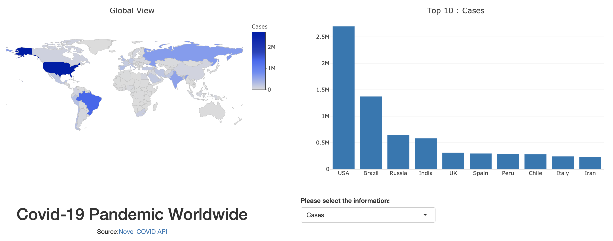

```{r setup, include=FALSE}
knitr::opts_chunk$set()
```

## Application : Covid-19 Pandemic Worldwide

This application provide global view and top ten rank for covid-19 global pandemic information.
\
```{r pressure, echo=FALSE, out.width = '100%'}

```
\
There are 3 steps to built plots in this application

## Step 1 : Load library and data
We use the source data from <a href="https://corona.lmao.ninja/">Novel COVID API</a>
```{r library1, warning=FALSE, message=FALSE}
library(plotly)
library(dplyr)
library(jsonlite)

covid19 <- fromJSON("https://corona.lmao.ninja/v2/countries?sort=country")

variable <- 'cases' # Example
```

```{r library2, warning=FALSE, message=FALSE}
covid19 <- covid19 %>% mutate(val=get(variable))
title <- switch(variable,
                    'cases' = 'Cases',
                    'todayCases' = 'Today Cases',
                    'deaths' = 'Deaths',
                    'todayDeaths' = 'Today Deaths', 
                    'recovered' = 'Recovered', 
                    'todayRecovered' = 'Today Recovered',
                    'active' = 'Active Cases', 
                    'critical' = 'Critical Cases', 
                    'casesPerOneMillion' = 'Cases Per One Million',
                    'deathsPerOneMillion' = 'Deaths Per One Million')
```

## Step 2 : Plot Global View

```{r firstplot1, warning=FALSE, message=FALSE}
l <- list(color = toRGB("grey"), width = 0.5)
fig <- plot_geo(covid19, 
                type='choropleth',
                locations=covid19$countryInfo$iso3, 
                z=covid19$val, 
                text=covid19$country,
                marker = list(line = l),
                colorscale="Blues",
                reversescale =T)
        
g <- list(showframe = FALSE,
          showcoastlines = FALSE,
          projection = list(type = 'Mercator'))
fig <- fig %>% colorbar(title = title)
fig <- fig %>% layout(title = 'Global View', geo = g)
fig
```

## Step 3 : Plot Top 10 Rank

```{r secondplot1, warning=FALSE, message=FALSE}
top10 <- covid19 %>% arrange(desc(val)) %>% top_n(10)
top10$country <- factor(top10$country, 
                      levels = unique(top10$country)[order(top10$val, decreasing = TRUE)])
```

```{r secondplot2, warning=FALSE, message=FALSE}
fig <- plot_ly(
  x = top10$country,
  y = top10$val,
  type = "bar")
fig <- fig %>% layout(title = paste('Top 10 Rank :', title))
fig
```

